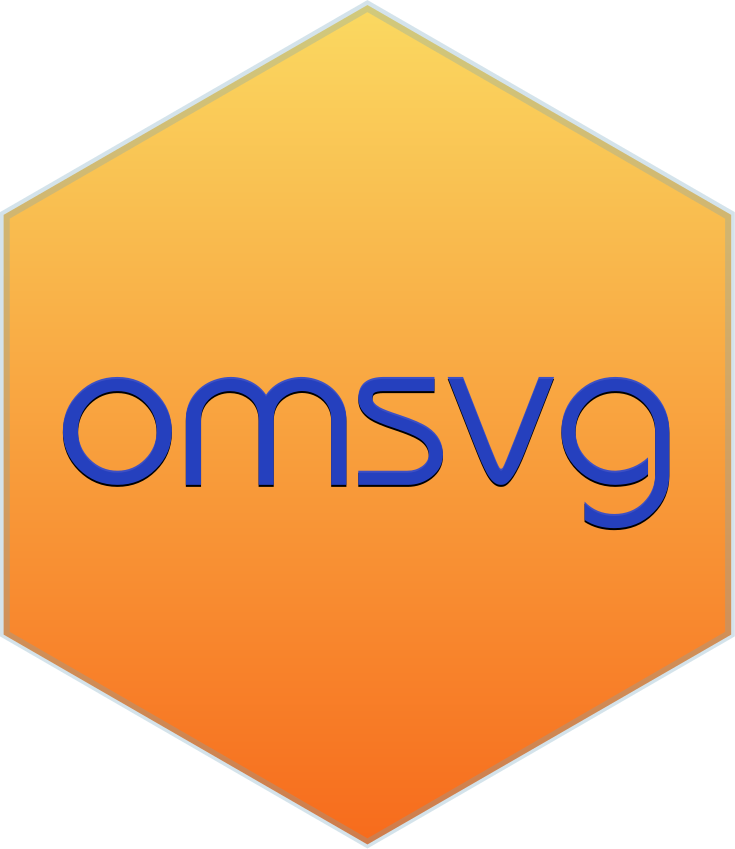

<!-- README.md is generated from README.Rmd. Please edit that file -->

```{r, include = FALSE}
knitr::opts_chunk$set(
  collapse = TRUE,
  comment = "#>",
  fig.path = "man/figures/README-",
  out.width = "100%"
)

library(omsvg)
```

# omsvg 

<!-- badges: start -->
[](https://www.tidyverse.org/lifecycle/#experimental)
[](https://CRAN.R-project.org/package=omsvg)
[](https://travis-ci.org/rich-iannone/omsvg)
<!-- badges: end -->

## Overview

Scalable vector graphics, SVGs, are *fantastic*. The **omsvg** package lets you make SVGs using the **R** programming language, and, it tries to make the whole process a little less difficult. We can create SVG elements, transform them programmatically, apply filters, and even animate them!

### Creating a Simple SVG

The process of using **omsvg** begins with the `SVG()` function. That allows you to define the overall size of the graphic and set some global options. Let's start simple and make an SVG with three elements: (1) a rectangle, (2) an ellipse, and (3) some text. To do this, we'll use the `svg_rect()`, `svg_ellipse()`, and `svg_text()` functions.

```{r create_simple_svg}
svg <- 
  SVG(width = 250, height = 100) %>%
  svg_rect(x = 25, y = 25, width = 50, height = 50, fill = "yellow") %>%
  svg_ellipse(x = 125, y = 50, width = 50, height = 50, stroke = "magenta") %>%
  svg_text(x = 175, y = 50, text = "this is text", attrs = svg_attrs_pres(font_family = "Helvetica"))
```

```{r simple_svg_display, echo=FALSE}
svg %>% as.character() %>% cat()
```


Aside from rectangles, ellipses, and text, we can also elect to use circles (`svg_circle()`), lines (`svg_line()`), *polylines* (`svg_polyline()`), polygons (`svg_polygon()`), and as-complex-as-you-can-make-'em paths (`svg_path()`).

### Animating an SVG

One thing that's really great about SVGs is that they can be animated, and, almost everything in an SVG is animatable. The **omsvg** package lets us animate each element with minimal frustration. Here is an example of a rectangle being quite animated.

```{r animating_rectangle}
svg_rectangle_anim <- 
  SVG(width = 700, height = 150) %>%
  svg_rect(
    x = 100, y = 75,
    width = 100, height = 100,
    stroke = "cyan",
    fill = "lightblue",
    anims = anims(
      0.5 ~ list(
        anim_position(initial = TRUE),
        anim_rotation(initial = TRUE)
      ),
      2.0 ~ list(
        anim_position(x = 500, y = 75, easing_fn = ease_in_out()),
        anim_rotation(90, easing_fn = ease_in_out())
      )
    )
  )
```

```{r animated_svg_display, echo=FALSE}
svg_rectangle_anim %>% as.character() %>% cat()
```


Animations are made through reference to keyframe times. Each of these times (in seconds) is like a transition point. Above, the rectangle is held at its initial position and rotation state until `0.5` seconds has elapsed. At `2.0` seconds, the second keyframe, the rectangle's position is to be moved from `{x = 100, y = 100}` to `{x = 500, y = 100}`, and, its rotation state should change to `90` degrees. We can assign a `timing` function that governs the tweening of the animation. For the position and rotation changes, these are both using the `ease_in_out()` timing function (where movement eases into a maximum speed and then decelerates to a stop).

## Installation

You can install the development version from [GitHub](https://github.com/) with:

```{r eval=FALSE}
# install.packages("devtools")
devtools::install_github("rich-iannone/omsvg")
```
